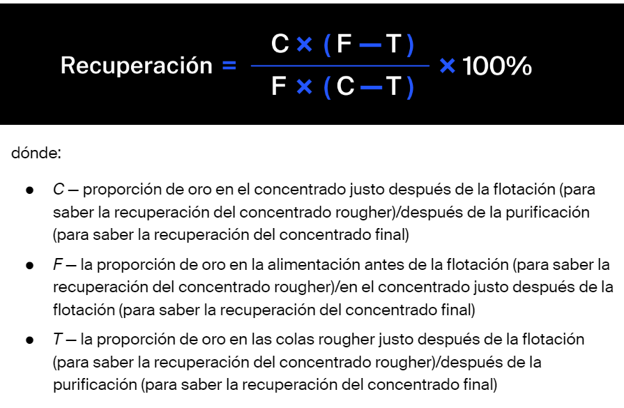
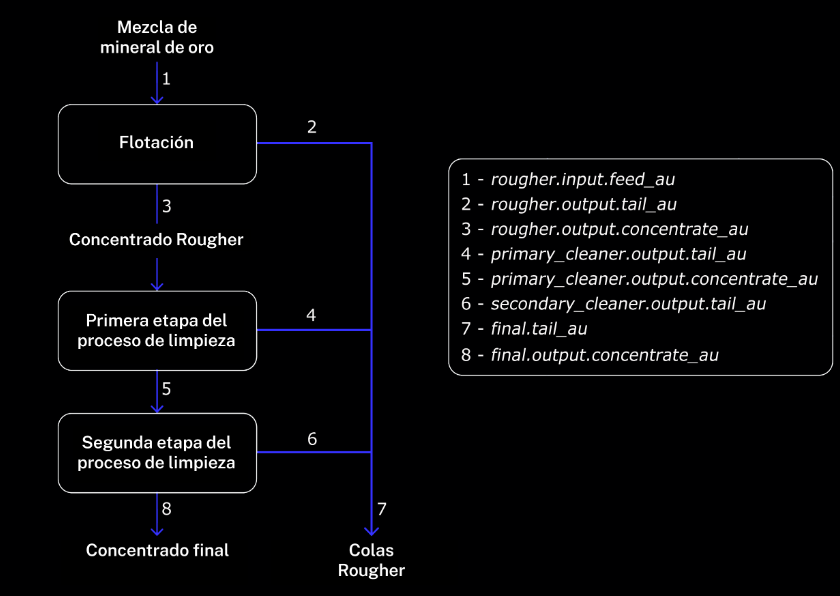

# Mineria
El objetivo es desarrollar un prototipo de machine learning para predecir la cantidad de oro extraido. Este modelo ayudara a optimizar la produccion y a eliminar los parametros no rengables.

La metrica utilizable para este modelo es sMAPE.

El calculo de la recuperacion de oro es:

Los pasos del proceso productivo son:

